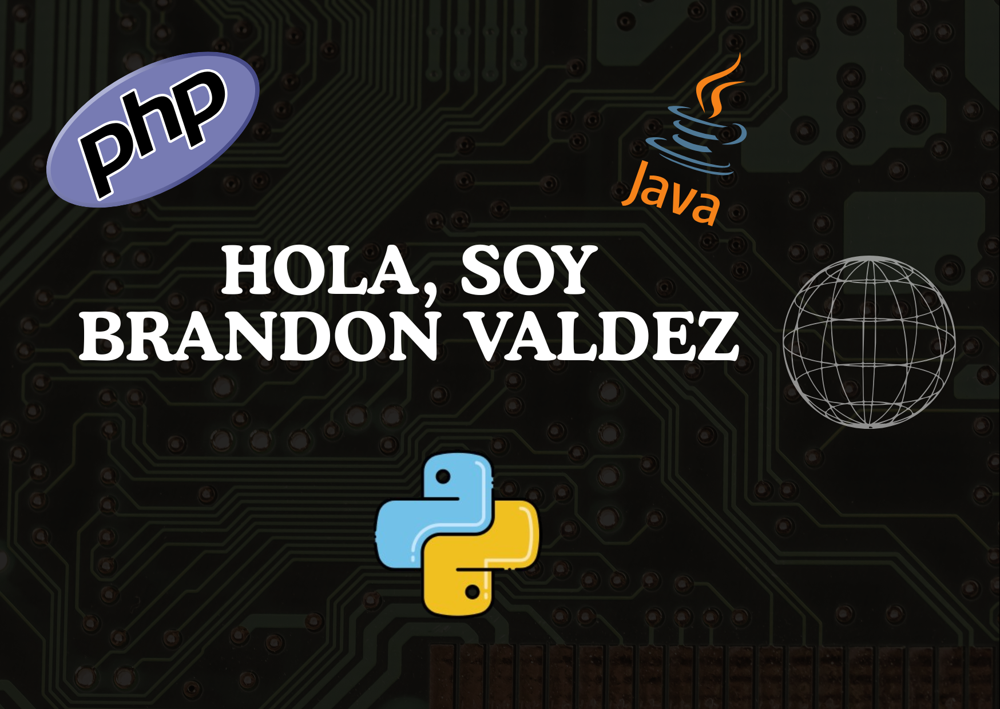

💻 **Desarrollador de software** apasionado por crear soluciones sólidas, escalables y bien estructuradas.  
Trabajo con tecnologías **backend, frontend**, manteniendo un enfoque en la **arquitectura limpia y rendimiento**, cuento con experiencia en leguajes como **PHP, C# y Python**.Actualmente me encuentro aprendiendo Java tanto en el área web como en el área movil.

---
## 📫 Contacto

  

---
