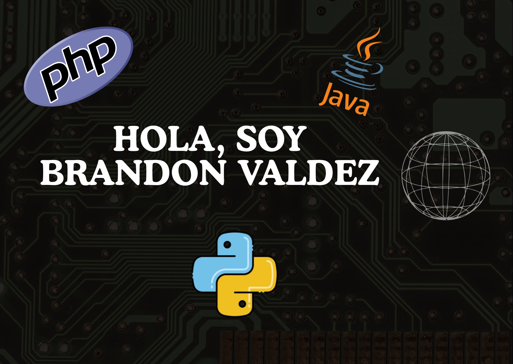

 ## Sobre mí

💻 Desarrollador de software apasionado por crear soluciones sólidas, escalables y bien estructuradas.

Soy Técnico en Ingeniería en Desarrollo de Software y actualmente estudiante de Ingeniería en desarrollo de software, enfocado en seguir fortaleciendo mis conocimientos y habilidades en distintas áreas del desarrollo.

Tengo experiencia en tecnologías backend y frontend, manteniendo un enfoque en arquitectura limpia, rendimiento y buenas prácticas de desarrollo. He trabajado con lenguajes como PHP, C#, Python y Java.

Actualmente desarrollo aplicaciones con Java para entornos web, móviles y de escritorio, ampliando constantemente mis conocimientos en el ecosistema Java y en el desarrollo de soluciones multiplataforma.

---
## 📫 Contacto

  

---
